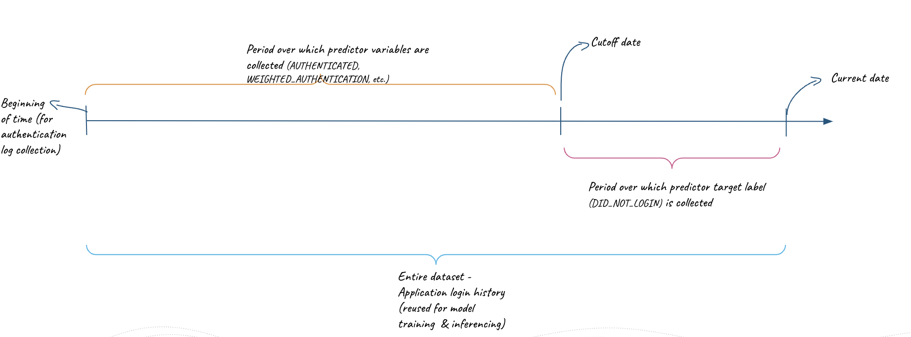

## Project Pre-requisites
The following need to be installed on your local dev machines prior to getting started on the setup & demo:
1. Conda  
2. Notebook
3. Git 

The project uses Python3.8 and Snowpark 1.4.0 versions.

## Components

The repo organizes the code into multiple folders:
1. config : Contains creds.json for Snowflake connection parameters. You should edit this file before running the main [notebook](src/python/snowpatrol/SnowPatrol_Licence_Revocation_Snowpark.ipynb).

2. data : Contains source data required for this application. 
    There's both real data with obfuscated PII that you can use (../obfuscated) or simulated data (../generated) while preparing for the test run of this application in your Snowflake environment.

3. deps: Empty directory, but is intended to organize any 3rd party libraries (out of Snowflake-Anaconda channel) that you may add while extending the application.
    This version doesnt use any external libraries outside of Snowflake-Anaconda channel.

4. src : Contains the source code for the application. 
    'snowpark' subdir contains the Python modules/notebooks 
    'streamlit' contains the streamlit UI for this app alongwith helper module


## Setup

1. Clone this git repo on your local machine:
    > ``` git clone git@github.com:snowflakecorp/gsi-se-snowpatrol-demo.git```

2. Create new **Conda** environment for local development:


    > ```conda env create -f environment.yml```
    >
    > ```conda activate snowpatrol-demo``` 


   Or, update environment after editing environment.yml to add/remove packages:
   > ```conda env update snowpatrol-demo``` <br/> 

3. Deploying Snowflake objects:

    - Update the connection parameters in [creds.json](config/creds.json) for the Snowflake account where you would like to deploy this application's objects (Database, Schema, Stages, Source Tables, etc.)

    - Go to [contants.py](src/python/snowpatrol/constants.py) to change the default names for the Snowflake objects that will be created. 
      NOTE that the table schema assumed by the main training procedure and UI is per the data samples provided. You might need to change 
      the column names if you plan to use your own source data.

    - Open the [SnowPatrol_Licence_Revocation_Snowpark.ipynb](src/python/snowpatrol/SnowPatrol_Licence_Revocation_Snowpark.ipynb) notebook, and run all the cells.
        There is a cell at the bottom through which you can test the train/revocation recommendation procedure by triggering locally.
    
    - Verify that the objects have been created in the configured database/schema in the designated Snowflake account.

4. Launching the application UI:

    - This repo ships with sample data (obfuscated for PII protection) that you can use to test the LR model that provides the revocation recommendations.

    - To interact with the app, start the streamlit UI page as (once the conda env has been activated):
    > ```cd src/streamlit; streamlit run About.py```<br/>
    
    This should launch a new browser tab in your current active browser window with the landing page.


5. Generating revocation recommendations:

    - Connect with the designated Snowflake account by filling in the account identifier and the username/password.

    - Select the execution context - the role that owns the target database where application's artifacts are deployed, the database , schema, and warehouse name.

    - The revocation recommendations take a few input parameters as:

        

        - Cutoff Days: How far back do you wish to go to pull login history for training?
        - Revocation probability threshold

      Default values are set for these options, but you may want to set these based on the data you're using. 
      With the sample data in this repo, the maximum login date recorded for both the apps is June/8/2023 and hence the 'cutoff_date' parameter would need be more than the default 30 days from the current date dependening on when you are running this application. 